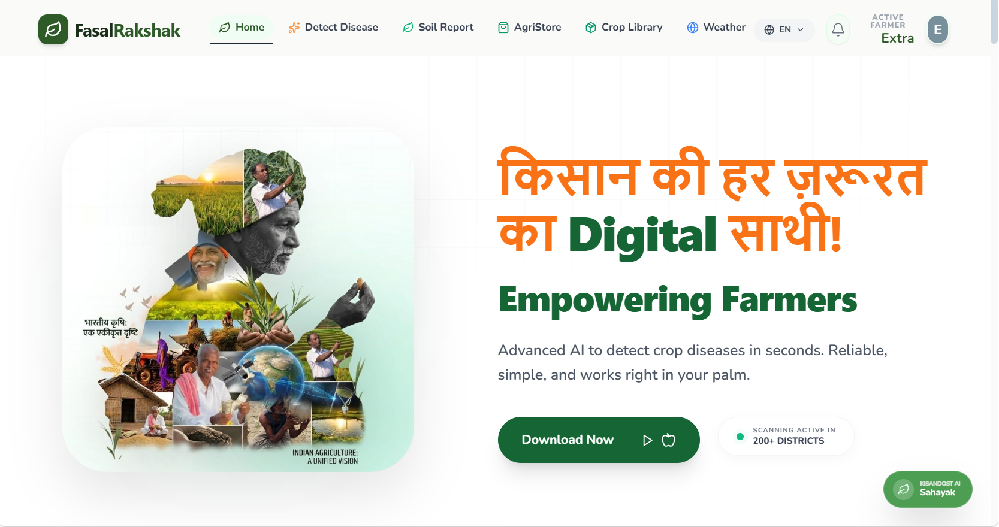
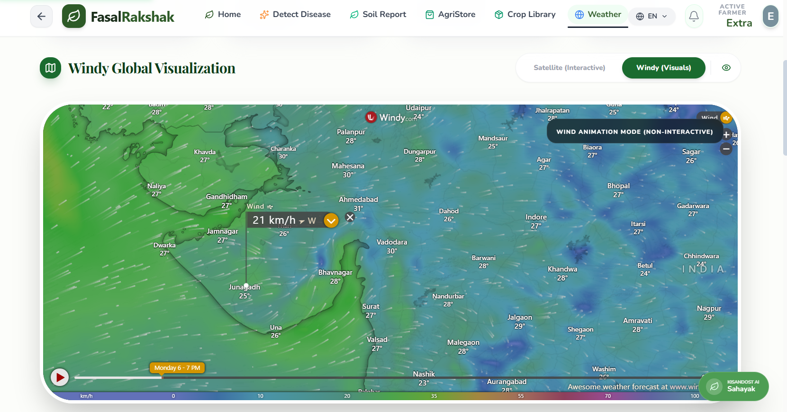

# 🌾 FasalRakshak — AI-Powered Crop Guardian

<div align="center">



<h3><strong>Bridging the Gap Between Advanced AI and Real-World Agriculture</strong></h3>

<p align="center">
  <strong>FasalRakshak</strong> is a next-generation companion built exclusively for farmers. We replace scattered data and guesswork with real-time, localized, and actionable agricultural intelligence — powered by cutting-edge AI, delivered in your native language.
</p>

<p align="center">
  <a href="#-key-features-at-a-glance">Features</a> •
  <a href="#-tech-stack">Tech Stack</a> •
  <a href="#-system-architecture">Architecture</a> •
  <a href="#-quick-start">Quick Start</a> •
  <a href="#-roadmap">Roadmap</a> •
  <a href="#-contributing">Contribute</a>
</p>

</div>

---

## 📸 Application Preview

| Landing Page | Weather Dashboard | 
|:---:|:---:|
|  |  | 

> _The application features a modern, dark-themed UI with fluid animations, glassmorphism cards, and AI-powered intelligence modules._

---

## 🌍 Why FasalRakshak?

At our core, FasalRakshak is driven by a **"Farmer-First"** philosophy. We understand that modern agriculture is fraught with risks: unpredictable weather, predatory pesticide marketing, and isolation in times of crisis. We built this platform to earn and protect your trust.

| Principle | What It Means for You |
|:---|:---|
| 🛡️ **No Corporate Spam** | We never push unnecessary chemicals or spam your inbox. Our recommendations strictly prioritize organic, sustainable practices. |
| 🆓 **Always Free to Use** | The core intelligence engines—weather prediction, disease detection, expert community—are completely free, forever. |
| 🔒 **Data Privacy** | Your farm data, locations, and queries are encrypted and anonymized. FasalRakshak works for *you*, not data brokers. |
| 🇮🇳 **Native Roots** | Built for the Indian ecosystem, with deep integrations for multiple regional farming nuances and languages. |
| 🤝 **Community First** | A growing WhatsApp community of farmers sharing real-world, peer-verified agricultural wisdom. |

---

## 🚀 Key Features at a Glance

```
┌─────────────────────────────────────────────────────────────────┐
│                     FASALRAKSHAK CORE MODULES                    │
├──────────────┬──────────────┬───────────────┬─────────────────┤
│   🤖 CROP    │   🌤️ WEATHER │  🧪 SOIL      │   🛒 AGRISTORE  │
│   PATHOLOGY  │   & CROP     │  HEALTH HUB   │   MARKETPLACE   │
│   ENGINE     │   ADVISOR     │               │                 │
├──────────────┴──────────────┴───────────────┴─────────────────┤
│   📚 DISEASE    │  💬 KISAN WHATSAPP  │  🌍 MULTILINGUAL     │
│   LIBRARY       │  COMMUNITY          │  SUPPORT (EN/HI/GUJ) │
└─────────────────┴──────────────────────┴───────────────────────┘
```

### 1. 🤖 Advanced Crop Pathology Engine

Don't guess what's ruining your crop. Upload or snap a photo of a struggling leaf, and our vision models take over instantly.

```
┌──────────────────────┐     ┌──────────────────┐     ┌────────────────────┐
│   📸 Upload Image    │ ──▶ │   🧠 Gemini AI   │ ──▶ │   📋 Diagnosis     │
│   (Leaf/Plant)       │     │   Vision Analysis│     │   + Treatment Plan │
└──────────────────────┘     └──────────────────┘     └────────────────────┘
         │                            │                          │
         ▼                            ▼                          ▼
   📱 MobileNet              ☁️ Cloudinary             🏥 Nearby Farmer
   (Offline fallback)         (Image Storage)           Alert System
```

- **Detailed Pathology:** Rapidly diagnoses biological threats without requiring a lab test
- **Organic Cures:** Prioritizes accessible, natural remedies over expensive chemical interventions
- **Dual AI Engine:** Powered by both **Gemini Vision API** (cloud) and **MobileNet/TensorFlow.js** (offline)
- **Cloudinary Integration:** Secure, permanent image storage for historical tracking
- **Nearby Alert System:** Notifies farmers in the vicinity about potential disease outbreaks
- **Printable Reports:** Generate PDF-formatted reports for offline reference

### 2. 🌤️ Hyper-Local Weather & Crop Suitability Advisor

Traditional weather apps tell you it's 32°C. FasalRakshak tells you if 32°C is going to damage your upcoming harvest.

```
┌────────────────────────────────────────────────────────────────┐
│              🌡️ WEATHER INTELLIGENCE PIPELINE                   │
├────────────────────────────────────────────────────────────────┤
│                                                                │
│  ┌─────────────┐    ┌─────────────────┐    ┌───────────────┐  │
│  │  📍 GPS /   │───▶│  🌐 Open-Meteo  │───▶│  🗺️ Leaflet   │  │
│  │  City Input │    │  API (Real-time)│    │  Interactive  │  │
│  └─────────────┘    └─────────────────┘    │  Satellite    │  │
│                           │                 │  Map          │  │
│                           ▼                 └───────────────┘  │
│                   ┌─────────────────┐                          │
│                   │  🌾 Crop Engine  │                          │
│                   │  25+ Crop DB     │                          │
│                   │  Seasonal Scores │                          │
│                   └────────┬────────┘                          │
│                            ▼                                    │
│                   ┌─────────────────┐                          │
│                   │  📊 Recharts     │                          │
│                   │  Trend Analysis │                          │
│                   └─────────────────┘                          │
│                                                                │
└────────────────────────────────────────────────────────────────┘
```

- **Pinpoint Accuracy:** Uses Open-Meteo API with no API key required
- **Dual Map Modes:** High-resolution satellite imagery + real-time wind overlay via Windy embed
- **25+ Crop Database:** Real-time suitability scoring for Rice, Wheat, Maize, Cotton, Sugarcane, Tomato, Onion, Potato, and more
- **Seasonal Intelligence:** Kharif, Rabi, and Zaid crop recommendations based on current weather
- **Farmer Advisory Cards:** Contextual warnings for humidity, heat, wind, and rain risks
- **Irrigation Logging:** Automatic water management suggestions

### 3. 🧪 Smart Soil Health Hub

Upload laboratory reports, scan soil images, or manually enter NPK values. Get AI-powered fertilizer recommendations in seconds.

- **Three Input Modes:** Manual entry, PDF upload (via Tesseract.js OCR), and image scanning
- **Visual NPK Dashboard:** Animated charts showing Nitrogen, Phosphorus, and Potassium levels
- **Organic/Chemical Toggle:** Switch between organic and chemical treatment recommendations
- **Health Index Scoring:** 0-100 soil health score with detailed breakdown
- **Firebase Integration:** Save and track soil reports across seasons

### 4. 🛒 AgriStore Ecosystem

A polished, dedicated marketplace built directly into the app for sourcing essential organic materials.

```
┌──────────────────────────────────────────────────────┐
│                   AGRISTORE MODULE                   │
├──────────────────────────────────────────────────────┤
│                                                      │
│  🔍 Search & Filter    │    📦 Product Grid         │
│  ─────────────────     │    ───────────────────     │
│  • By category         │    • Pesticides            │
│  • By price range      │    • Fertilizers           │
│  • By location         │    • Seeds                 │
│  • By rating           │    • Tools                 │
│                        │    • Soil Products         │
│                                                      │
│  ┌──────────────────────────────────────────────┐  │
│  │           🛒 SMART CART SYSTEM                 │  │
│  │  • Persistent cart (localStorage)             │  │
│  │  • WhatsApp Checkout (no payment gateway)     │  │
│  │  • Multi-language order messages              │  │
│  └──────────────────────────────────────────────┘  │
│                                                      │
└──────────────────────────────────────────────────────┘
```

- **Smart Filtering:** Find seeds, organic fertilizers, tools, or expert literature instantaneously
- **WhatsApp Checkout:** Bypass complex digital checkouts — orders go directly to vetted local suppliers via WhatsApp
- **Live Price Banner:** Real-time pricing status indicators
- **Expert Help Integration:** Connect with agricultural experts directly from the store

### 5. 📚 Crop Disease Library

A comprehensive reference of 40+ common crop diseases with verified treatments.

- **Multi-Criteria Search:** Filter by crop, disease type, severity, and regional prevalence
- **Sorting Options:** Alphabetical, severity-based, and region-specific sorting
- **Crop Category Section:** Quick browsing by crop type (Wheat, Rice, Cotton, etc.)
- **Detailed Disease Cards:** Symptoms, organic cures, preventive measures, and spread rate indicators
- **Multilingual Content:** Disease names and symptoms in English, Hindi, and Gujarati

### 6. 💬 Kisan WhatsApp Community

Farming is a collective effort. Join regional groups of fellow farmers across multiple states.

- **Peer-to-Peer Wisdom:** Share crop tips, verify pest outbreaks, get real-world advice
- **Quality Moderation:** Groups kept clean of spam and misinformation
- **One-Click Join:** Integrated seamlessly via WhatsApp deep links
- **Regional Groups:** State-specific communities for hyper-local relevance

### 7. 🌍 Unified Multilingual Architecture

Technology must speak your language. FasalRakshak is engineered with a scalable global state system that instantly localizes UI across:

| Language | Code | Coverage |
|:---|:---:|:---|
| 🇬🇧 English | EN | Full UI + Disease Library |
| 🇮🇳 Hindi | HI | Full UI + Disease Library |
| 🇮🇳 Gujarati | GUJ | Full UI + Disease Library |

---

## 🏗️ Tech Stack

### Frontend Core

| Technology | Version | Purpose |
|:---|:---:|:---|
| ⚛️ **React** | 19.x | Core UI framework with hooks |
| ⚡ **Vite** | 8.x | Blazing-fast builds and HMR |
| 🎨 **Tailwind CSS** | 3.x | Utility-first styling with custom design tokens |
| 🎬 **Framer Motion** | 12.x | Fluid animations and route transitions |
| 📊 **Recharts** | 3.x | Data visualization and charts |
| 🗺️ **Leaflet + React-Leaflet** | 1.9.x / 5.x | Interactive satellite weather maps |
| 🤖 **TensorFlow.js + MobileNet** | 4.x | Offline disease classification |
| 📄 **Tesseract.js** | 7.x | OCR for soil report PDF scanning |
| 🌐 **Google Generative AI** | 0.24.x | Gemini-powered disease analysis |
| 🔥 **Firebase** | 12.x | User authentication and data persistence |
| ☁️ **Cloudinary** | — | Image upload and permanent storage |
| 🌲 **React Three Fiber / Three.js** | 9.x / 0.183 | 3D ecosystem visualization |
| 🔐 **Clerk React** | 5.x | Authentication and user management |
| 📅 **date-fns** | 4.x | Date manipulation |
| 🖼️ **browser-image-compression** | 2.x | Client-side image optimization |

### Backend & Data Services

| Technology | Purpose |
|:---|:---|
| 🟢 **Node.js / Express 5** | Scalable API gateways |
| 🍃 **MongoDB + Mongoose** | Document database for user profiles and scan history |
| 🔑 **JWT + bcryptjs** | Secure authentication and authorization |
| 🤖 **Groq / Gemini APIs** | Real-time AI analysis and vision routing |
| 🧠 **Anthropic API** | Advanced agricultural advisory engine |
| 💬 **WhatsApp API** | Direct community links and supplier communication |
| 🌐 **Open-Meteo API** | Free weather data (no API key required) |
| 🗺️ **OpenStreetMap / ArcGIS** | Geocoding and satellite tile services |
| 📈 **Agmarknet / data.gov.in** | Government market rate integration |

---

## 📐 System Architecture

```
┌─────────────────────────────────────────────────────────────────────┐
│                         FASALRAKSHAK SYSTEM                         │
│                                                                      │
│  ┌──────────────────────────────────────────────────────────────┐   │
│  │                        CLIENT LAYER                           │   │
│  │  ┌─────────┐ ┌─────────┐ ┌─────────┐ ┌─────────┐ ┌─────────┐ │   │
│  │  │ Landing │ │ Weather │ │ Detect  │ │  Store  │ │  Soil   │ │   │
│  │  │  Page   │ │Dashboard│ │  Scan   │ │Market   │ │ Report  │ │   │
│  │  └────┬────┘ └────┬────┘ └────┬────┘ └────┬────┘ └────┬────┘ │   │
│  │       │           │           │           │           │       │   │
│  │       └───────────┴───────────┴───────────┴───────────┘       │   │
│  │                          │                                    │   │
│  └──────────────────────────┼────────────────────────────────────┘   │
│                             │                                          │
│  ┌──────────────────────────┼────────────────────────────────────┐   │
│  │                   INTELLIGENCE LAYER                            │   │
│  │  ┌─────────────┐ ┌─────────────┐ ┌─────────────┐                │   │
│  │  │  Gemini AI  │ │  Groq API   │ │ TensorFlow │                │   │
│  │  │  (Cloud)   │ │  (Fast AI)  │ │  MobileNet │                │   │
│  │  └──────┬──────┘ └──────┬─────┘ └──────┬──────┘                │   │
│  │         │               │              │                        │   │
│  │  ┌──────┴───────────────┴──────────────┴──────┐                │   │
│  │  │            AI Service Orchestrator           │                │   │
│  │  │   (Smart routing, fallback logic, caching)   │                │   │
│  │  └─────────────────────┬───────────────────────┘                │   │
│  └────────────────────────┼────────────────────────────────────────┘   │
│                            │                                           │
│  ┌────────────────────────┼────────────────────────────────────────┐   │
│  │                  API GATEWAY LAYER                              │   │
│  │  ┌─────────────┐ ┌─────────────┐ ┌─────────────┐                │   │
│  │  │ /api/auth   │ │ /api/scans  │ │/api/profile │                │   │
│  │  │  (JWT Auth) │ │ (AI + DB)   │ │ (User Data) │                │   │
│  │  └──────┬──────┘ └──────┬──────┘ └──────┬──────┘                │   │
│  │         │               │              │                        │   │
│  │  ┌──────┴───────────────┴──────────────┴──────┐                │   │
│  │  │         Express 5 Server + CORS + Middleware │                │   │
│  │  └─────────────────────┬───────────────────────┘                │   │
│  └────────────────────────┼────────────────────────────────────────┘   │
│                            │                                           │
│  ┌────────────────────────┼────────────────────────────────────────┐   │
│  │                    DATA LAYER                                    │   │
│  │  ┌─────────────┐ ┌─────────────┐ ┌─────────────┐                │   │
│  │  │  MongoDB    │ │ Firebase   │ │ Cloudinary  │                │   │
│  │  │ (User Data) │ │ (Auth+    │ │ (Images)    │                │   │
│  │  │             │ │  Storage)  │ │             │                │   │
│  │  └─────────────┘ └─────────────┘ └─────────────┘                │   │
│  └─────────────────────────────────────────────────────────────────┘   │
│                                                                      │
└──────────────────────────────────────────────────────────────────────┘
```

### Data Flow

```
┌──────────────────────────────────────────────────────────────────────────┐
│                        USER INTERACTION → ACTION FLOW                     │
├──────────────────────────────────────────────────────────────────────────┤
│                                                                          │
│  USER INPUT                    AI PROCESSING              OUTPUT          │
│  ──────────                    ─────────────              ──────          │
│                                                                          │
│  📸 Crop Photo                 Gemini Vision API           Disease name,  │
│  ─────────────                + MobileNet fallback        severity,       │
│  • Camera capture             → AI Analysis               treatments,     │
│  • Gallery upload             → Cloudinary upload         prevention     │
│  • 10MB max                   → DB persistence            ─────────      │
│                                                                          │
│  🌡️ City Search               Open-Meteo API              Weather data,  │
│  ───────────────              + Reverse geocoding         forecast,      │
│  • GPS detection              → Crop suitability engine   crop recs      │
│  • Manual input              → Recharts visualization    ─────────      │
│  • Map click                  → Farmer advisory cards     ─────────      │
│                                                                          │
│  📄 PDF Report                Tesseract.js OCR            Soil health   │
│  ──────────────               → NPK extraction             score,         │
│  • Lab report scan            → AI fertilizer rec        fertilizer    │
│  • Manual NPK input          → Firebase save             suggestions    │
│                                                                          │
│  🛒 Cart + Checkout           WhatsApp API                Order message  │
│  ────────────────             → Pre-filled order form     sent to        │
│  • Add to cart               → Multi-language message    supplier       │
│  • Quantity adjust           → Deep link generation     ─────────      │
│                                                                          │
└──────────────────────────────────────────────────────────────────────────┘
```

---

## 📁 Project Structure

```
fasalrakshak/
├── README.md                    # Project documentation
├── assets/
│   └── landing_preview.png       # Landing page screenshot
│
└── fasalrakshak/                # Monorepo root
    ├── package.json              # Root scripts (install-all, dev)
    │
    ├── frontend/                 # React SPA (Vite)
    │   ├── index.html
    │   ├── vite.config.js
    │   ├── tailwind.config.js
    │   ├── eslint.config.js
    │   └── src/
    │       ├── main.jsx          # App entry point
    │       ├── App.jsx           # Root component + routing
    │       ├── index.css         # Global styles + Tailwind
    │       │
    │       ├── pages/            # Route-level page components
    │       │   ├── LandingPage.jsx
    │       │   ├── Home.jsx
    │       │   ├── Login.jsx
    │       │   ├── Signup.jsx
    │       │   ├── Profile.jsx
    │       │   ├── Weather.jsx    # Weather + Crop Advisor
    │       │   ├── Detect.jsx    # Disease Scanner
    │       │   ├── SoilReport.jsx
    │       │   ├── Ecosystem.jsx  # 3D Visualization
    │       │   ├── DiseaseLibrary.jsx
    │       │   ├── DiseaseDetail.jsx
    │       │   └── Store/
    │       │       ├── index.jsx # AgriStore
    │       │       ├── StoreCart.jsx
    │       │       ├── ProductCard.jsx
    │       │       ├── ProductModal.jsx
    │       │       ├── SearchFilterBar.jsx
    │       │       ├── StoreHeader.jsx
    │       │       ├── RecommendedBanner.jsx
    │       │       ├── ExpertHelpBanner.jsx
    │       │       ├── AIProductInsight.jsx
    │       │       └── storeData.js
    │       │
    │       ├── components/        # Reusable UI components
    │       │   ├── detect/       # Disease detection UI
    │       │   ├── soil/        # Soil analysis UI
    │       │   ├── diseases/    # Disease library UI
    │       │   ├── store/       # Store-specific components
    │       │   ├── tree/         # 3D Tree Scene (React Three Fiber)
    │       │   ├── organic/     # Organic mode components
    │       │   ├── Navbar.jsx
    │       │   ├── Footer.jsx
    │       │   ├── ScrollToTop.jsx
    │       │   └── ...
    │       │
    │       ├── context/         # React Context providers
    │       │   ├── AuthContext.jsx
    │       │   └── LanguageContext.jsx
    │       │
    │       ├── hooks/           # Custom React hooks
    │       │   └── useStoreProducts.js
    │       │
    │       ├── lib/             # Core utility libraries
    │       │   ├── firebase.js       # Firebase initialization
    │       │   ├── gemini.js         # Gemini AI client
    │       │   ├── cloudinary.js     # Image upload service
    │       │   ├── ai_service.js     # AI orchestration
    │       │   ├── DiseaseRegistry.js
    │       │   ├── LocalClassifier.js # TensorFlow.js wrapper
    │       │   └── Constants.js
    │       │
    │       ├── locales/        # i18n translation files
    │       │   ├── en.js
    │       │   ├── hi.js
    │       │   └── gu.js
    │       │
    │       ├── data/           # Static JSON data
    │       │   └── diseases.json
    │       │
    │       ├── images/         # Static images
    │       ├── services/       # API service modules
    │       └── utils/          # Helper utilities
    │
    └── backend/                # Node.js/Express API
        ├── server.js           # Express app entry
        ├── package.json
        │
        ├── config/
        │   └── db.js           # MongoDB connection
        │
        ├── models/             # Mongoose schemas
        │   ├── Kisan.js        # User/farmer model
        │   └── Scan.js         # Disease scan record
        │
        ├── controllers/         # Route handlers
        │   ├── authController.js
        │   ├── profileController.js
        │   └── scanController.js
        │
        ├── routes/             # Express routes
        │   ├── authRoutes.js
        │   ├── profileRoutes.js
        │   └── scanRoutes.js
        │
        ├── middleware/         # Express middleware
        │   └── authMiddleware.js
        │
        └── ai_service/        # Python AI services
            ├── crop_memory_engine.py
            └── sms_service.py
```

---

## ⚙️ Quick Start

### Prerequisites

| Requirement | Version | Notes |
|:---|:---:|:---|
| Node.js | ≥ 18.x | LTS recommended |
| npm | ≥ 9.x | Comes with Node.js |
| MongoDB | Atlas or Local | Free tier on Atlas is sufficient |

### Environment Variables

Create a `.env` file in the **backend** directory:

```env
# Backend (.env)
PORT=5000
CLIENT_URL=http://localhost:5173
MONGODB_URI=mongodb+srv://<user>:<pass>@cluster.mongodb.net/fasalrakshak
JWT_SECRET=your_super_secret_jwt_key_here
GEMINI_API_KEY=your_gemini_api_key_here
ANTHROPIC_API_KEY=your_anthropic_api_key_here
```

Create a `.env` file in the **frontend** directory:

```env
# Frontend (.env)
VITE_GEMINI_API_KEY=your_gemini_api_key_here
VITE_OPENWEATHER_API_KEY=your_openweather_api_key_here
VITE_CLOUDINARY_CLOUD_NAME=your_cloud_name
VITE_CLOUDINARY_UPLOAD_PRESET=your_upload_preset
```

### Installation

```bash
# Option 1: Clone the repository
git clone https://github.com/kamleshchandela/FourZero.git
cd FourZero/fasalrakshak

# Option 2: Install all dependencies (frontend + backend)
npm run install-all

# Option 3: Manual installation
cd frontend && npm install
cd ../backend && npm install
```

### Development

```bash
# Start both frontend and backend concurrently
npm run dev

# Or run them separately:
npm run client   # Frontend → http://localhost:5173
npm run server  # Backend  → http://localhost:5000
```

### Production Build

```bash
cd frontend
npm run build    # Creates optimized build in dist/
npm run preview  # Preview production build locally
```

---

## 🧪 Feature Flags & Module Status

| Module | Status | AI Backend | Offline Capable |
|:---|:---:|:---|:---:|
| 🔬 Disease Detection | ✅ Active | Gemini + MobileNet | ✅ Partial |
| 🌤️ Weather Dashboard | ✅ Active | Open-Meteo | ❌ |
| 🌾 Crop Suitability | ✅ Active | Local Algorithm | ✅ Full |
| 🧪 Soil Health Hub | ✅ Active | Local Engine | ✅ Full |
| 📚 Disease Library | ✅ Active | Static JSON | ✅ Full |
| 🛒 AgriStore | ✅ Active | — | ✅ Full |
| 💬 WhatsApp Community | ✅ Active | — | ✅ Full |
| 🌲 3D Ecosystem | ✅ Active | Three.js | ✅ Full |
| 📊 Mandi Price Sync | 🔄 Roadmap | Agmarknet API | — |
| 🤖 Crop Memory Engine | 🔄 Roadmap | Python ML | — |
| 📱 PWA / Mobile App | 🔄 Roadmap | — | — |

---

## 📊 Project Statistics

| Metric | Value |
|:---|:---|
| 📁 Total Source Files | 200+ |
| 🧩 Components | 80+ |
| 🌍 Languages Supported | 3 (EN, HI, GUJ) |
| 🌾 Crops in Database | 25+ |
| 🦠 Diseases Documented | 40+ |
| 🔌 External APIs | 8+ |
| 📦 npm Dependencies | 100+ |

---

## 🚀 The Roadmap

> This is just V1. Here's what we're focused on shipping next:

| Feature | Priority | ETA |
|:---|:---:|:---|
| 📊 Predictive Yield Analytics | 🔴 High | V2.0 |
| 📈 Mandi Price Sync (Agmarknet) | 🔴 High | V2.0 |
| 🔬 Expanded Pathology Library | 🟡 Medium | V2.1 |
| 🌾 Regional Cash Crop Support | 🟡 Medium | V2.1 |
| 📱 PWA / Mobile App (React Native) | 🔴 High | V3.0 |
| 🤖 Crop Memory Engine (Python ML) | 🟡 Medium | V2.5 |
| 🗣️ Voice Input (Speech-to-Text) | 🟢 Low | V3.0 |
| 📡 LoRaWAN Sensor Integration | 🟢 Low | V4.0 |
| 🌐 Multi-country Expansion | 🟢 Low | V5.0 |

---

## 🤝 Contributing

We build better completely together. Contributions are what make the open-source community such an amazing place to learn, inspire, and create.

```bash
# 1. Fork the Project
# 2. Create your Feature Branch
git checkout -b feature/AmazingFeature

# 3. Commit your Changes
git commit -m 'feat: Add some AmazingFeature'

# 4. Push to the Branch
git push origin feature/AmazingFeature

# 5. Open a Pull Request
#    → Target: main branch
#    → Description: What changed and why
#    → Screenshots: Before/After if UI changes
```

### Coding Standards

- **React:** Functional components with hooks, no class components
- **Styling:** Tailwind CSS utility classes, custom design tokens in `tailwind.config.js`
- **State Management:** React Context for global state (Auth, Language)
- **API Calls:** Fetch API with async/await, proper error handling
- **Animations:** Framer Motion for all transitions and micro-interactions
- **i18n:** All user-facing strings must be in locale files (en.js, hi.js, gu.js)
- **Accessibility:** ARIA labels, keyboard navigation, semantic HTML

---

## 📄 License

Free and ethical open-source software distributed under the **MIT License**.

```
MIT License

Copyright (c) 2025 FourZero Team — FasalRakshak

Permission is hereby granted, free of charge, to any person obtaining a copy
of this software and associated documentation files (the "Software"), to deal
in the Software without restriction, including without limitation the rights
to use, copy, modify, merge, publish, distribute, sublicense, and/or sell
copies of the Software, and to permit persons to whom the Software is
furnished to do so, subject to the following conditions:

The above copyright notice and this permission notice shall be included in all
copies or substantial portions of the Software.

THE SOFTWARE IS PROVIDED "AS IS", WITHOUT WARRANTY OF ANY KIND, EXPRESS OR
IMPLIED, INCLUDING BUT NOT LIMITED TO THE WARRANTIES OF MERCHANTABILITY,
FITNESS FOR A PARTICULAR PURPOSE AND NONINFRINGEMENT.
```

---

## 🙏 Acknowledgments

| Service | Use Case | Tier |
|:---|:---|:---:|
| **Open-Meteo** | Weather data (free, no API key) | Free |
| **Gemini (Google)** | Crop disease vision analysis | Free tier |
| **Groq** | Fast AI inference | Free tier |
| **Anthropic** | Advanced agricultural advisory | Paid |
| **Cloudinary** | Image storage and optimization | Free tier |
| **MongoDB Atlas** | Database hosting | Free tier |
| **Vercel / Netlify** | Frontend deployment | Free tier |
| **Render** | Backend API deployment | Free tier |
| **Clerk** | User authentication | Free tier |
| **Tailwind CSS** | UI design system | Open-source |
| **React Three Fiber** | 3D visualization | Open-source |

---

## 🙌 Author & Team

<h3 align="center">Built with 💻 and 🌾 by the FourZero Team</h3>

<div align="center">

[](https://github.com/kamleshchandela)
[](https://x.com/Kamlesh__cg)
[](https://www.linkedin.com/in/kamlesh-chandela/)

</div>

---

<div align="center">

**If this project helps you protect your crops and grow better harvests, please give it a ⭐**

*"The future of Indian agriculture is smart, sustainable, and AI-powered."*

</div>

---

<!--
  ╔══════════════════════════════════════════════════════════════════╗
  ║                                                                  ║
  ║     🌾 FASALRAKSHAK — PROTECTING FARMS WITH AI INTELLIGENCE 🌾   ║
  ║                                                                  ║
  ╚══════════════════════════════════════════════════════════════════╝
-->
